_After the party cools down, we still want an inclusive AGI that more people can use._

## Opening
Over the past year, we often described the LLM developer ecosystem as a “hackathon in the real world.” The phrase fits. It has energy, speed, luck, and flashes of talent. It also has noise, repeated work, short-lived projects, and repos that become famous overnight only to be covered by the next wave a few days later.

By mid-2026, the feeling is different. The change is no longer just “a few more Agent projects.” Something deeper is shifting: the way software is made is starting to move.

In the past, people used software. Software was designed around human hands, eyes, and attention: buttons, forms, editors, and chat boxes. Now agents are becoming a new kind of software user. They read files, call APIs, run commands, open PRs, write tests, review code, and wait for human approval before moving on. They do not always sit inside a chat box. They do not only answer questions. They are entering the inner workflow of software.

So the most useful question is not whether Agentic AI has a bubble. Of course it does, and it will have more. The better questions are: when the hackathon fever cools down, where will software go? What will developers become? What role is left for open source? And why do we need an inclusive AGI future?

## Signals From Platforms
_Models have not made software smaller. They have widened its boundary._

If we only watch product launches, it is easy to think that models are the whole story of AI. But when we look at GitHub and Hugging Face together, a different picture appears.

GitHub tells us what developers are building. Octoverse 2025 shows that GitHub has more than 180 million developers. In 2025, it added more than 36 million new developers, about one new developer every second. From January to April 2026, OpenDigger events recorded 13.016 million active developers and 27.107 million active repositories. Software production has not shrunk because models got stronger. It is still expanding.
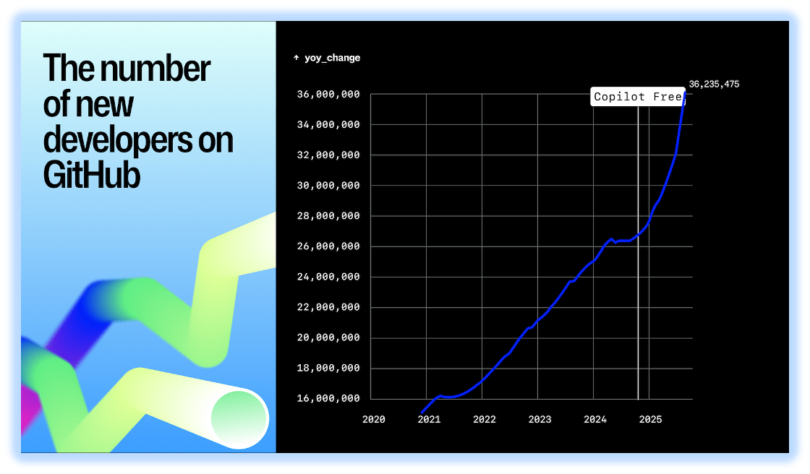
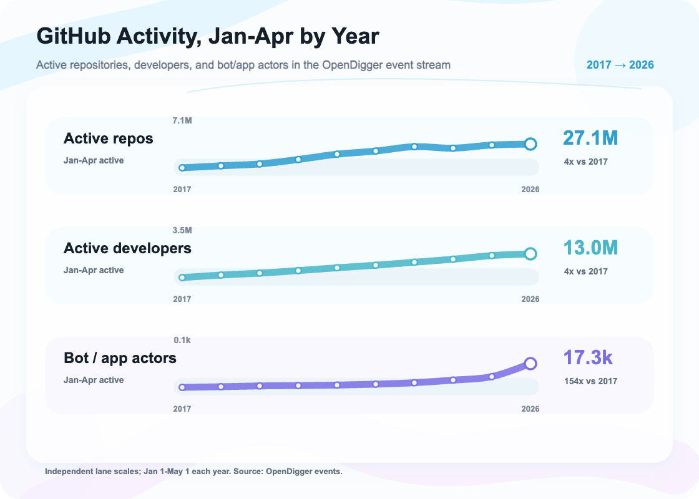

The more interesting signal is automated accounts. In the first four months of 2017, only 112 bot or app actors were active in the GitHub event stream. In the same period in 2026, the number reached 17,285. That is 154 times larger across the ten-year window. The first four months of 2026 alone already doubled the same period in 2025. Today, open-source collaboration can no longer be imagined as “human developers working on GitHub, with a few CI bots doing chores on the side.” Automated accounts are entering the software production chain. They are becoming part of the collaboration network.

Hugging Face gives another signal. It shows how models are published, downloaded, changed, and reproduced. The number of public models has reached 2 million. It grew by more than 100% in the past year, and more than 540,000 models were added by May 2026 alone. A model platform is no longer just a display case for research models. It looks more like a busy factory. Some people publish foundation models. Some fine-tune them. Some quantize them. Some convert formats. Some upload adapters. Some move the same capability to different devices and runtime environments.
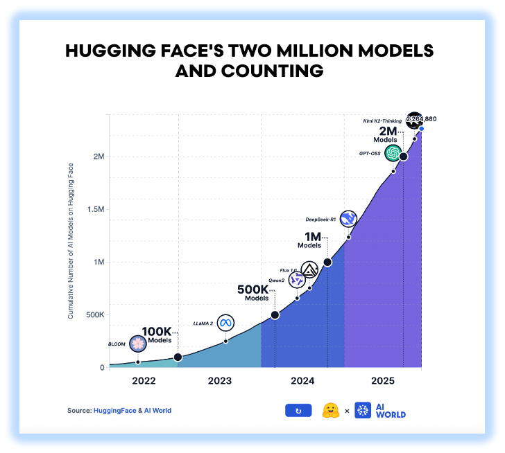

The GitHub collaboration list and star-growth list tell a similar story. AI projects have entered the core engineering world. Developer attention and curiosity are strongly focused on repos around new words like **Agent, Claude Code, and Skills**. But real collaboration still happens around the long-term foundations and complex systems of software. In other words, models have not eaten software. They are rewriting the division of labor inside software.
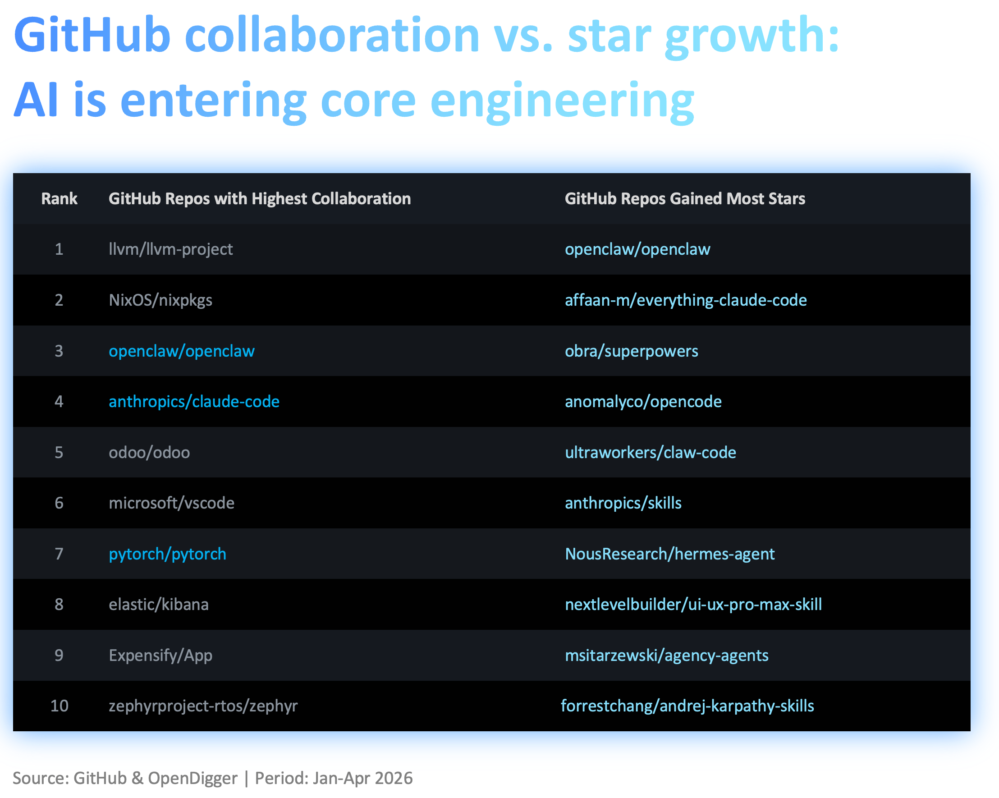

Models handle understanding, generation, reasoning, and tool use. Software puts models into reliable workflows. It manages data, permissions, state, cost, audit, and delivery. The closer models get to real work, the more software is needed to define boundaries, save process, connect systems, and handle failure. Models have not made software smaller. They have widened its boundary.

## The Agentic AI Ecosystem Architecture
_The ecosystem has moved from an LLM toolchain to a full execution stack for Agentic AI._

When we built the LLM developer landscape last year, the main question was still: which projects should be on the map? At that time, the ecosystem was slowly forming layers around LLM SDKs, RAG, agent frameworks, application platforms, and inference infrastructure. People cared about how to connect models, build RAG, write an agent, and run inference services.

By 2026, this question became harder. There are too many projects. They change too fast. Even many older projects are redefining themselves.

OpenClaw launched in November 2025 and passed 200,000 stars in February 2026. It took only 84 days. React, the software foundation that shaped modern frontend development, took almost ten years to reach the same number. This does not mean OpenClaw already has React’s long-term engineering impact. It means GitHub’s attention system, the speed of spread in the AI era, and developer expectations for agentic software have all changed.

Projects appear too fast, and attention moves too fast. A static map can easily capture only one moment. So this time we separated two jobs. The landscape map makes judgments and selects a set of representative projects worth watching. The dynamic leaderboard checks the temperature. It tracks Agentic AI projects that developers have actually worked on, and shows which projects suddenly became hot, which ones kept their heat, and which ones started to show real collaboration.

This dynamic leaderboard, built with OpenDigger, is now live on the inclusionAI website: [https://www.inclusion-ai.org/insight](https://www.inclusion-ai.org/insight)

The latest monthly OpenRank Top 10 looks like a cross-section of the ecosystem. Claude Code, Codex, OpenCode, and Gemini CLI sit near the task-entry layer. vLLM, SGLang, TensorRT-LLM, and PyTorch sit near the infrastructure layer. Entry projects are closer to developers and users, so issues and PRs are busier. Infrastructure projects may have less scattered participation, but the collaboration density is high. What is heating up is not a single entry point. It is the whole execution system.
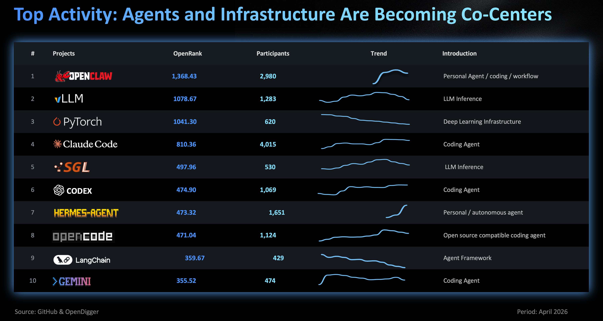

The structural change is clear. In 2025, the landscape was still sorting SDKs, RAG, ChatUI, and MLOps. In 2026, leading projects are being rearranged around the task execution system of agents.

The landscape from last May still felt very much like an LLM toolchain. We were mostly looking at which SDK to use for LLM apps, which RAG and vector database to connect data, and which inference framework to run models. By May 2026, the focus had moved from “how to write an agent” to “how agents enter task execution.”

This makes the three-layer architecture of Agentic AI in 2026 easier to read. At the top are human-agent collaboration and task entry. In the middle are token supply and scheduling. At the bottom are the model capabilities themselves.
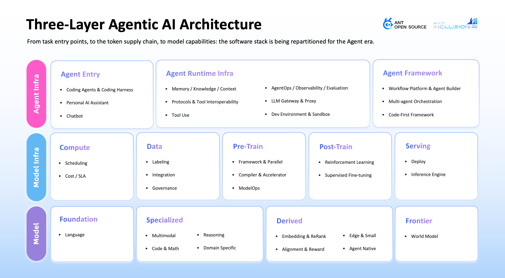

**Agent Infra decides who AI can work for.** It includes the entry points users meet directly, such as coding agents. It also includes agent runtime infrastructure, such as context, tool use, sandbox, and AgentOps. It also includes agent builders, orchestrators, and operators.

**Model Infra decides whether this can scale.** It includes data, training, inference serving, deployment, scheduling, and operations. If an agent only answers one sentence, the lower-level cost can be ignored. But once it reads code, searches information, calls tools, waits for feedback, and keeps going, tokens stop being chat consumption. They become production material.

**Models decide where the capability boundary is.** The model layer still matters. But it can no longer be understood only by asking who has the higher benchmark. Frontier and foundation models explore the upper bound. Small edge models solve low-cost, low-latency, and privacy-heavy cases. Specialized models adapt to code, finance, and services. Real tasks will look more like model portfolios than one model ruling everything.
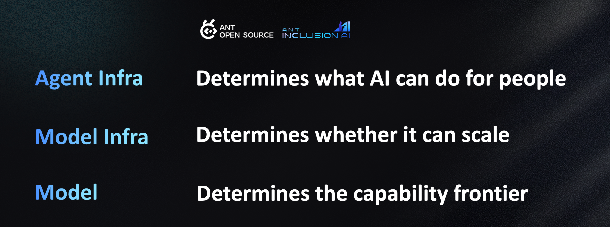

These three layers are not a simple supply chain. They push one another forward. When agents try to do longer tasks, Model Infra is forced to lower inference cost, increase context throughput, and improve observability. When Model Infra improves, small models and specialized models become easier to use in production. When the model layer improves in reasoning, tool use, and multimodality, agents are pushed further out of the chat box.

### Agent Infra: Redefining How Software Is Used
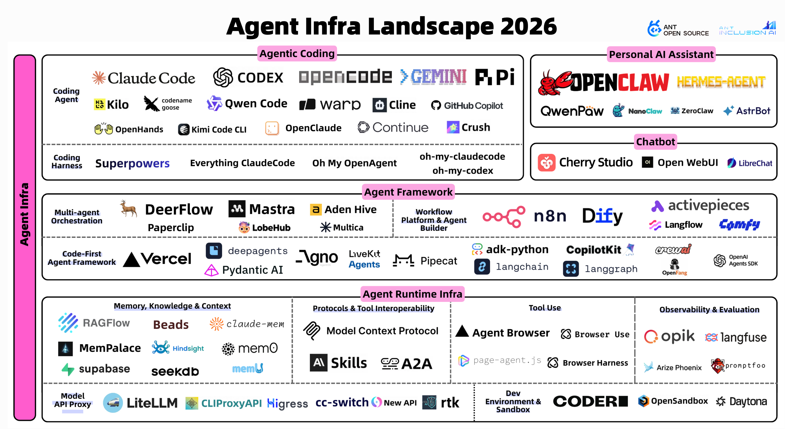

Agent Infra is the busiest layer in this dataset, and also the easiest to misread. On the surface, products like OpenClaw, Claude Code, and Codex are fighting for attention. Deeper down, this layer is redefining how software is used. **Agent Infra is bringing silicon-based executors into the software world.**

**Coding agents are the first real large-scale entry point for Agentic AI, because code is a natural place for agents to work. It has files, tests, logs, version control, diffs, PRs, reviews, and rollback. Almost all the feedback loops machines need already exist in the code world.**

In the past, software assumed that its user was human. We designed UI for people. We wrote docs for people. We gave people buttons and forms. In the agent era, software has a new user. This user may not need a beautiful interface. It needs stable APIs, tool protocols, permission boundaries, readable state, executable commands, verifiable results, and rollback.

An agent without context is only briefly awake. Without tools, it can only give advice. Without permission control, it cannot enter real systems. Without sandbox and rollback, companies will not let it act. Without observability and evaluation, humans cannot know why it failed.

Software is being repackaged as a runtime environment that agents can enter. APIs, MCP, tool protocols, context, sandbox, and observability are becoming new basic parts.

We gave the descriptions and READMEs of 226 projects to a model and built a multi-label classification. The result is telling. Coding Agent has 78 projects and 14,019 participants. MCP has 59 projects and 6,651 participants. Memory has 70 projects and 7,609 participants. Observability has 71 projects and 5,463 participants. Gateway has 31 projects and 2,637 participants. These labels overlap, so we should not add them up. But the horizontal view is enough: attention is moving from “building a product that can chat or write code” to putting context, tools, gateways, sandboxes, and observability into a runtime.
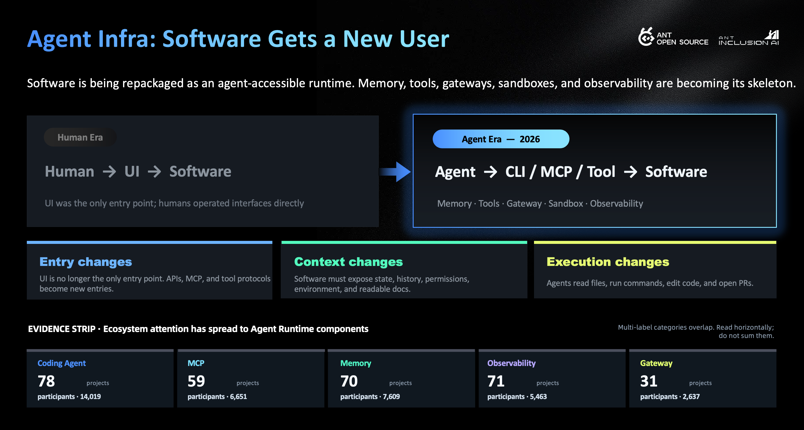

### Model Infra: The Main Job Is Supplying Tokens at Scale
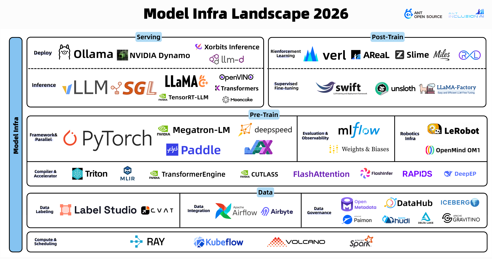

The inference layer is splitting into several jobs. High-throughput engines such as vLLM and SGLang run models faster, more reliably, and more cheaply. Edge and local inference projects such as llama.cpp bring models to personal computers, private environments, and edge devices. Data-center schedulers such as Dynamo and Ray Serve handle multi-model, multi-tenant, multi-GPU, and multi-region operation. Gateways and proxies such as LiteLLM and OpenRouter handle model routing, fallback, unified interfaces, cost tracking, and audit.

Post-training is another key part of this layer. Projects like AReaL and Slime show the rise of reasoning training and Agentic RL. In the agent era, RL is not only about making models answer better. It is also about making them better at using tools, following constraints, keeping state in long tasks, and knowing when to stop and ask a human.
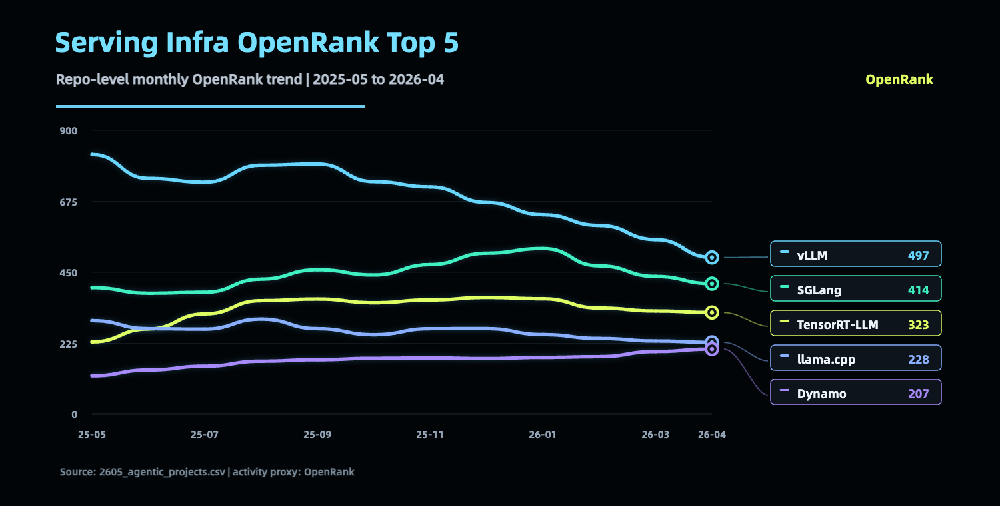

**The future cost advantage of AI will not come only from cheaper models. It will also come from better token supply-chain management.** The value of Model Infra is to orchestrate these capabilities like electricity, logistics, and databases. Whoever can make tokens stable, cheap, observable, and governable will own a real production infrastructure in the agent era.

This is similar to the early evolution of cloud computing. At first, people cared about whether they could run services at all. Later, the real competition became scheduling, elasticity, observability, cost, SLA, supply chain, and developer experience. Model Infra is moving along the same path.

Harder evidence comes from the community itself. In mid-May 2026, leading serving projects still had a high build tempo. Release notes, roadmap issues, and bug reports kept repeating words like PD disaggregation, KV cache, router, scaling, fault tolerance, and health check.

SGLang [issue #21846](https://github.com/sgl-project/sglang/issues/21846) names its latest roadmap “Distributed KVCache System For Agentic Workload.” It says clearly that agentic workloads are driving fast growth in KV cache storage and transfer volumes, and that the current PD disaggregation and HiCache designs are hitting limits. **Agents have changed the consumption structure of tokens.**

Dynamo [issue #5506](https://github.com/ai-dynamo/dynamo/issues/5506), the H1 2026 roadmap, focuses on request scheduling, KV cache reuse, worker scaling, and service availability in Kubernetes and multi-node environments. **The serving battle is expanding from a single inference engine to an inference system.**

Another issue, [SGLang issue #20252](https://github.com/sgl-project/sglang/issues/20252), records a very real large-scale deployment failure: qwen3-32b-fp8, with 90 prefill and 30 decode workers, running on an H20 cluster. After some prefill nodes restarted or migrated, decode kept retrying, health checks failed, the router removed workers, traffic moved to the remaining nodes, and under high QPS the system ended in cascading failures and 503s. The lesson is simple: running the model is only the first step. The harder industrial problem is whether a single node’s instability will be amplified by routing, health checks, and traffic shifting into a global failure. **In production, the real pain is stability.**

### Model: There Is No Single Winner
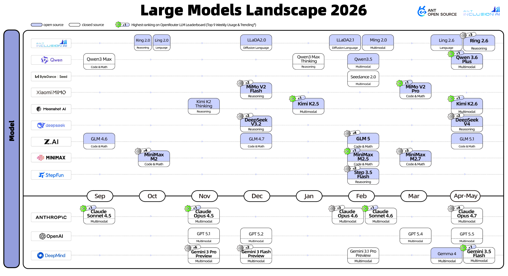

The model layer is still the source of capability for the whole ecosystem. But it can no longer be understood by asking only who has more parameters or a higher benchmark.

Hugging Face derivative and download data reminds us that a model’s life does not stop at release. Model families such as Qwen and Gemma matter not only because the models are strong, but also because people fine-tune them, quantize them, convert them, distill them, and move them to edge devices and application scenarios. Models are starting to have downstream ecosystems like open-source software packages: people fork them, patch them, make lightweight versions, build domain versions, and create compatibility layers.
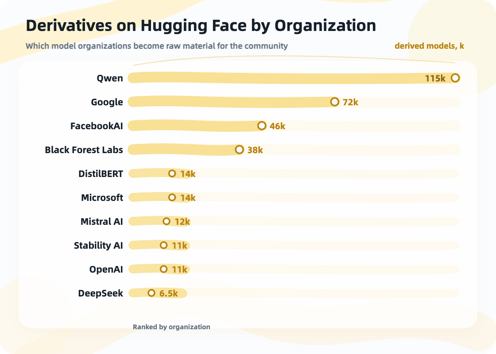
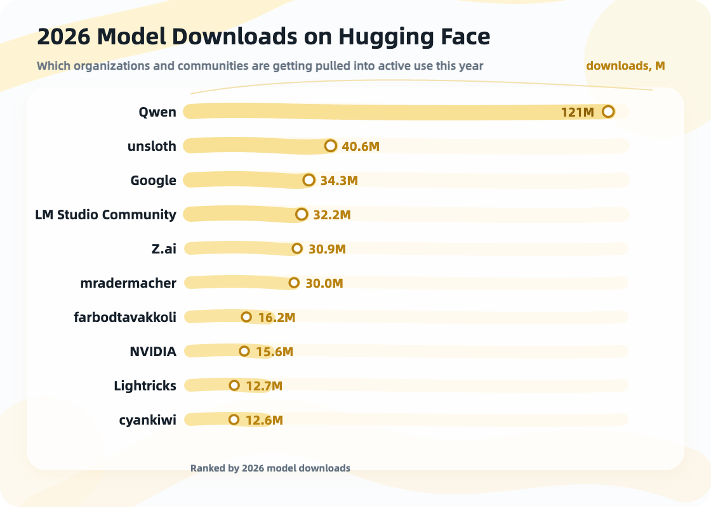

_Hugging Face shows signals of model release, download, and reproduction._

OpenRouter’s token usage leaderboard breaks the story of a single champion model. Coding may use one model. Long-context research may use another. Low-cost batch processing may use another. Voice, image, and video may use others. Local privacy scenarios may need a different stack again. Real usage is unlikely to settle on one permanent winner. Users route across price, speed, context length, tool use, coding ability, and free quotas.
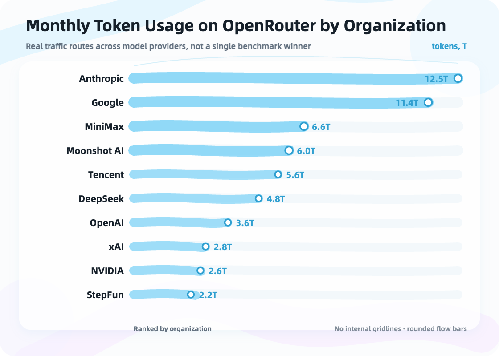
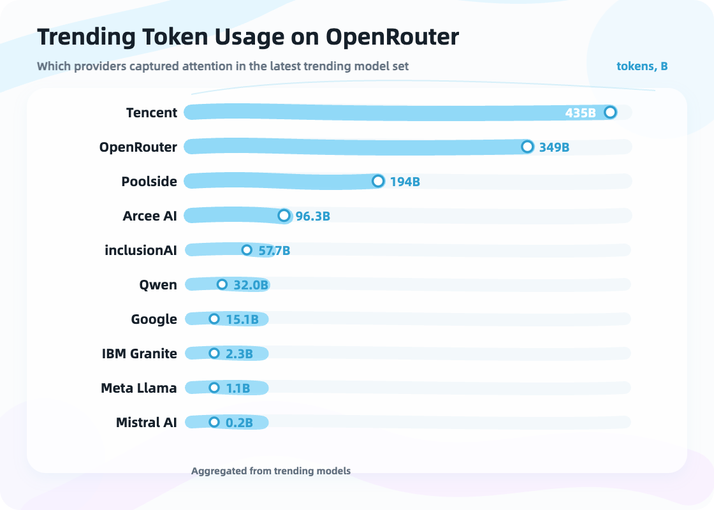

_Real token usage shows the reality of many models, many providers, and many routes._

This view is already supported by research and engineering practice. [RouteLLM](https://arxiv.org/abs/2406.18665), from ICLR 2025, runs a clear comparison: first judge the difficulty of the request, then decide whether to use a strong model or a cheaper model, instead of sending every request to the most expensive model. On some benchmarks, this routing approach keeps quality close to the strong model while cutting cost to less than half. [IPR](https://aclanthology.org/2025.emnlp-industry.170/), from EMNLP Industry 2025, tests this idea in a large cloud platform deployment. It routes prompts across Claude models and reaches the quality of the strongest Claude model while reducing cost by 43.9%.
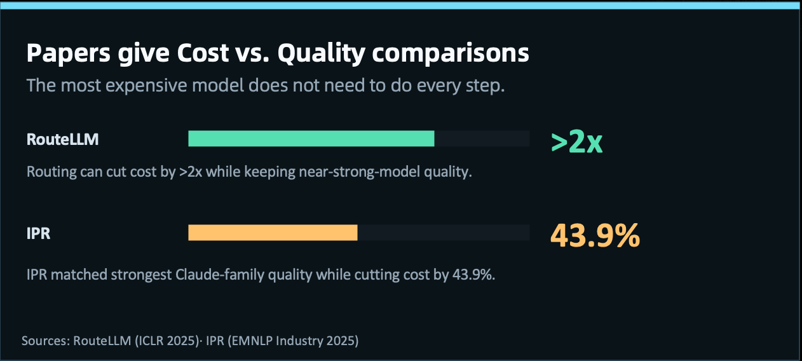

The open-source community is moving in the same direction. A GitHub Search API check in LiteLLM, one of the hottest model API routing projects, shows that routing terms related to cost, budget, and spend governance appear often in issues and PRs: 23 results for `cost based routing`, 18 for `lowest cost`, 37 for `budget routing`, and 76 for `spend tracking` as of May 22, 2026. Engineering teams are already asking: how do we route requests to models that are more suitable, cheaper, and easier to govern, while still keeping quality and stability?

## Trends and Project Stories
_Technical shifts also show up in how projects describe themselves._

### Description Signals: Projects Are Rewriting Their Self-Introductions
Classifications and leaderboards reveal structure, but they can still feel abstract. Many more interesting changes are hidden in a project’s own description, and in the repeated “what we are not” lines in READMEs.

After aligning historical landscape snapshots with current project data, we found that 96 out of 226 projects had changed their descriptions. The most visible new words include agent, harness, context, workflow, and MCP. These wording changes show projects looking for a new place in the ecosystem.
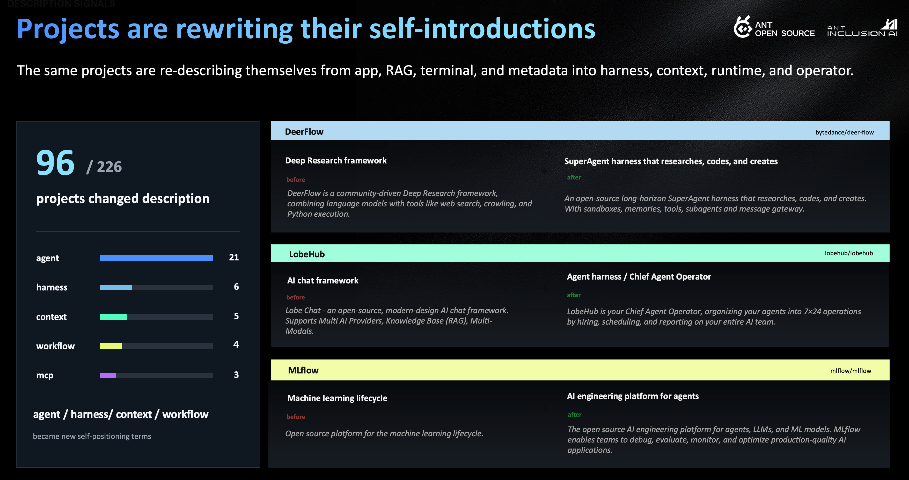

These changes move toward the agent execution stack along several common paths.

1. One common path is **Workflow Builder → Agent Orchestrator**. Projects such as Dify, Flowise, Langflow, and Activepieces used to answer the question “how do I build an LLM app or automation workflow?” Now they increasingly talk about agentic orchestration. `Deer-flow` is a sharp example. It used to describe itself as a community-driven Deep Research framework, with web search, crawling, and Python execution. Now it calls itself a long-horizon SuperAgent harness that can research, code, and create. Deep Research is moving from “help me look things up” to “execute long-running tasks.”

2. Another path is **RAG / Data / Vector DB → Context / Memory Infra**. RAGFlow, Chroma, DataChain, and Letta show that RAG and data are growing beyond “adding knowledge to models.” They are becoming long-term context, memory layers, and searchable workbenches for agents. DataChain moves from ETL, analytics, and versioning to a context layer for unstructured data. Chroma moves from an embedding database to search infrastructure for AI. Letta moves from memory services to a platform for stateful agents. These are all part of the same hidden line.

3. A third path is closer to the user entry point: **Chatbot / AI Client → Agent Workspace / Personal Assistant**. `lobehub/lobehub` is worth a closer look. Its old description called it Lobe Chat, a modern-design AI chat framework. Now it says users can find, build, and collaborate with agent teammates. Chatbot projects like LobeChat are actively escaping the name and imagination of the “chat box.” It is not just saying “we are also agents.” It is rewriting the product from Chat to Hub: from human-model conversation to humans living, working, and dividing tasks with agent teammates.

4. A path closer to developer tools is **Dev Tool / IDE / Terminal → Agentic Dev Environment**. Warp, Daytona, Coder, Continue, and Cline are turning developer tools into work environments for agents. Warp moves from an AI-powered terminal to an agentic development environment. Daytona moves from a dev environment manager to secure and elastic infrastructure for running AI-generated code. Continue moves from an AI code assistant to source-controlled AI checks and quality gates in CI. The shift is important: the software entry point is moving from “a person opens an IDE and writes code” to “a person defines the goal, and an agent executes in a controlled environment.”

5. At the framework layer, many projects are moving from **Framework → Agent Harness**. LangChain, deepagents, Mastra, Agno, and Hive are no longer satisfied with calling themselves a framework or SDK. They are moving toward platform, harness, and production AI. `harness` is a meaningful word in this shift. Among the 96 projects that changed descriptions, six now contain `harness`, and four of those added it later, including deer-flow, LobeHub, and Hive.

6. At the tool and gateway layer, the shift is **Tool Integration → Agent Control Plane**. Projects such as Composio, LiteLLM, and OpenSandbox push tool use beyond “function calling” or “API wrapper” toward something closer to a control plane. `ComposioHQ/composio` used to emphasize integrations and function calling. Now it says it powers 1,000+ toolkits, tool search, context management, authentication, and sandbox. It puts several key words of Agent Infra into one sentence.

7. At the model infrastructure layer, we see **RL / Inference / Training → Agent Workload Infra**. AReaL, verl, SGLang, and GPustack show that Agentic AI is rewriting not only the application layer, but also Model Infra. `areal-project/AReaL` used to call itself a Distributed RL System for LLM Reasoning. Now it is “The RL Bridge for LLM-based Agent Applications.” Post-training is being redefined by agent tasks. It is not enough for a model to “answer correctly.” It also needs to get things done across tool use, long tasks, environment feedback, and multi-step decisions.
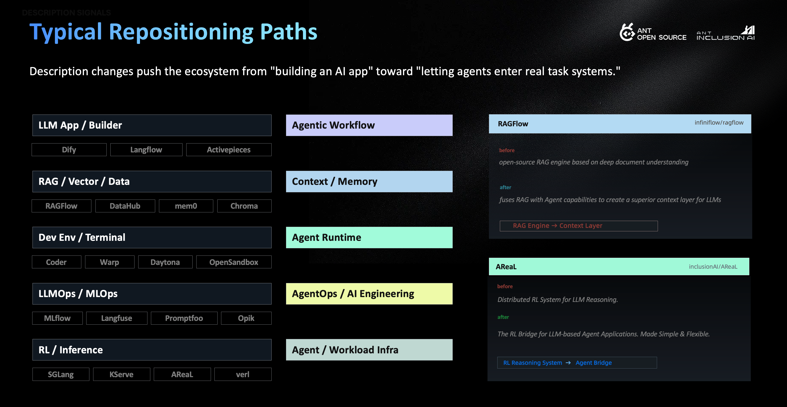

This kind of change can be misread as “everyone is just chasing the agent trend.” Some projects are doing that, of course. Every fast-growing ecosystem has this noise. But when a mature project changes its description, it often means the project has felt a real change in user demand.

Agentic AI is pulling together projects that used to sit separately in applications, data, developer tools, MLOps, cloud native, and models. RAG projects talk about context. Data governance projects talk about semantic layers that agents can use. Development environments talk about developers and their agents. Gateway projects talk about model routing and cost control. Every project is asking: if my users are not only humans, but also agents, what should I provide?

### README Evidence: Projects Say What They Are Not
Negative statements in READMEs give another kind of evidence. When a project keeps saying “not a...”, it is often not just explaining features. It is trying to escape the labels of the previous generation.
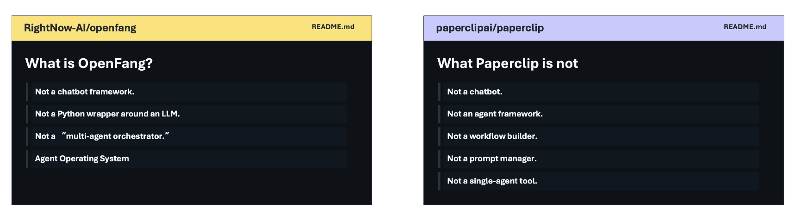

OpenFang calls itself an Agent Operating System. It also clearly rejects labels like chatbot framework, Python wrapper around an LLM, and multi-agent orchestrator. The message is direct: chat windows, thin SDKs, and simple orchestration are no longer enough for the position it wants. It wants to sit at the OS or runtime layer.

Paperclip is similar. It rejects chatbot, agent framework, workflow builder, prompt manager, single-agent tool, and code review tool. Instead, it says it wants to run a **zero-person company** made of agents.

Behind these negative statements is a set of labels that are losing energy: _chatbot framework, LLM wrapper, workflow builder, prompt manager_.

Users are no longer satisfied with a nice chat page, a model API relay, or a demo workflow. They are asking more concrete questions: _<u>How does an agent connect to real software? How are permissions managed? How are context and memory maintained over time? How are failures observed? How does code execution enter a sandbox? How is model cost controlled?</u>_

This is the line between Agentic AI as a toy and Agentic AI in production.

## Developers and AI Tools
_The stronger AI tools become, the heavier human responsibility becomes._

### Who Is Taking Part in the Agentic AI Ecosystem?
Before asking whether models will swallow software and open source, we should first look at how developers themselves are changing.

We built a developer profile from 226 Agentic AI projects. We counted actors who participated in these projects from January 1 to before May 1, 2026, keeping bot and app accounts. This gave us 563,973 developers or automated accounts. We then ranked the Top 10,000 by their April 2026 `community_openrank` contribution in these projects and added GitHub profile, company, and location. About 2.0% are likely bot or app actors, or 198 automated accounts.

Among these 10,000 high-contribution participants, 2,920 have identifiable company fields and 3,575 have standardized country fields. In self-reported companies, NVIDIA, Microsoft / GitHub, Intel, Google / DeepMind, and Red Hat rank high. In standardized countries, the United States has 1,113, China has 726, and India has 229. This is not a single group of “open-source hobbyists.” It is a network made of model companies, cloud vendors, chip companies, startups, university labs, independent developers, and automated accounts.
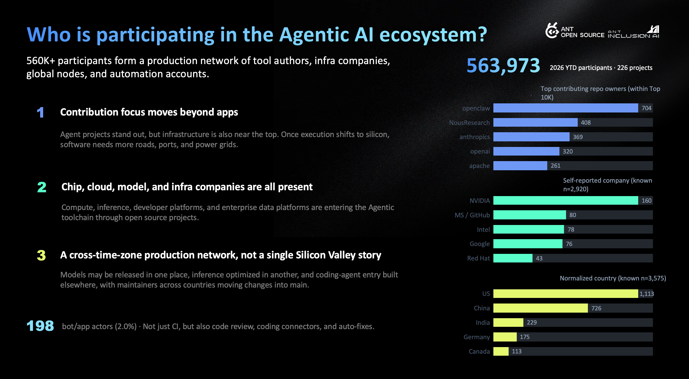

_Figure 11: The participant structure includes model companies, cloud vendors, chip companies, startups, open-source maintainers, independent developers, and automated accounts._

There are three interesting signals here.

First, the contribution center of Agentic AI does not sit only in “application startups.” Agent or model-native projects like openclaw are visible, of course. But apache and pytorch also appear near the top. The production network of Agentic AI has crossed the application layer. Some people build coding agents. Some build models and inference. Some work on data, workflows, and engineering infrastructure.

Second, self-reported company fields show that chip vendors, cloud and model companies, and open-source infrastructure companies are all present. Low-level compute and inference stacks are being pulled forward by agent demand. Large companies are entering toolchains and developer workflows through open-source projects. Infrastructure companies such as Red Hat and Databricks show that enterprise engineering and data platforms are joining the Agentic story.

Third, the geography has not collapsed into a single Silicon Valley story. The United States is still the largest node, but China, India, Germany, and Canada together form a production network across time zones. Agentic AI looks like a global engineering site. A model may be released in one place, inference optimized in another, and coding-agent entry points built in a third. Then maintainers, bots, and CI systems from different countries push changes into the main branch.

Automation is climbing up the software production chain step by step: first running tests, sending reports, and updating dependencies; then reading code, making suggestions, generating patches, and taking part in collaboration.

There are two kinds of bots here. The first is traditional automation: `github-actions[bot]`, `dependabot[bot]`, `codecov[bot]`, `copybara-service[bot]`, and `pytorchmergebot`. They keep large engineering projects moving. The second is a new generation of AI tools: `greptile-apps[bot]`, `coderabbitai[bot]`, `gemini-code-assist[bot]`, and `chatgpt-codex-connector[bot]`. They have moved beyond fixed scripts. They read code, understand context, comment on changes, and join reviews.
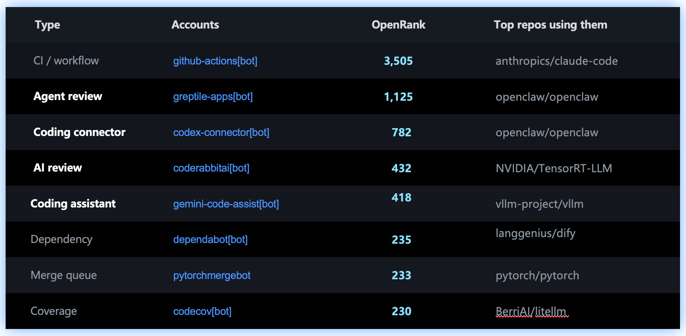

_Figure 12: Bots are no longer just CI noise. Some already handle review, code understanding, automated fixes, and agent connector work._

### Carbon-Based Definers and Silicon-Based Executors
The profile of real human developers is much richer than “programmers using AI to write code.” Top developers include independent tool builders, open-source maintainers, AI startup founders, engineers from cloud and model companies, researchers, tool authors, and community project maintainers. Some build agents. Some maintain inference and scheduling infrastructure. Some connect models to workflows. Some write rules, maintain communities, and handle issues and reviews.
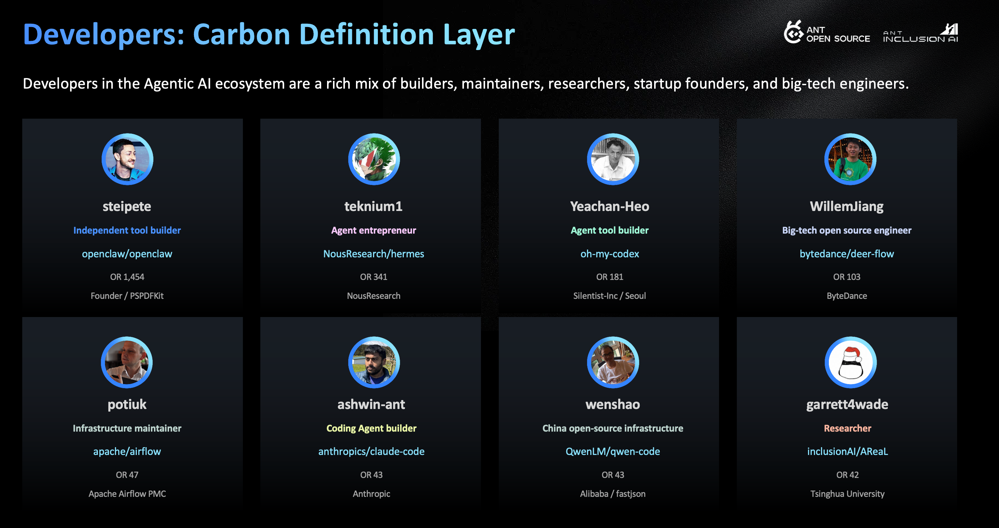

Among the 226 Agentic AI projects we track, 78 are related to coding agents. They have 3.86 million stars in total, and 14,019 participants in April 2026. The **CLI-first path**, represented by Claude Code and Codex, enters local repos, shells, tests, and git directly. The **IDE-first path**, represented by Cursor, keeps the developer’s mental model and lets people step in at any time. Devin, OpenHands, and Multica represent **cowork / cloud worker** systems that try to move tasks from issue to PR in the background. Harness tools around memory and team orchestration try to give agents a long-term work environment.

Leading projects are also using coding agents heavily. We scanned the file trees of the OpenRank Top 100 Agentic AI projects and found that 92 projects had at least one coding-agent-related configuration. On average, each project used 2.8 kinds. Claude Code had the highest coverage, at 81%. OpenAI Codex reached 69%.

There is also a small but telling detail. In `google/adk-python`, the project with the most agent markers, the only agent config directory that remains is `.gemini`. But `.gitignore` still contains traces of Codex, Claude, Cursor, Windsurf, Aider, Cline, Continue, and other tools. Files like `AGENTS.md`, `CLAUDE.md`, and `.cursor/rules` are like cheat sheets for AI. In the past, much project knowledge lived in maintainers’ heads: why this module should not be touched, which test is slowest, what to check before release, which dependency versions are tricky, and which changes require talking to someone first. In the agent era, if this hidden knowledge is not written down, agents cannot execute it reliably.
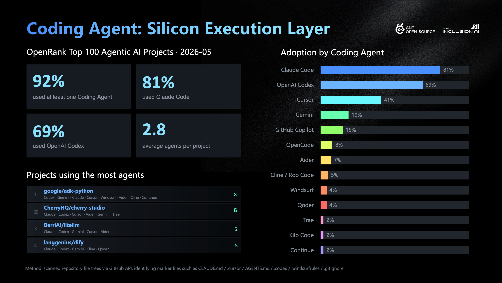

This is symbolic. Open-source projects used to write `CONTRIBUTING.md` for human contributors. Now projects are starting to write onboarding documents for agent contributors. Open-source collaboration is no longer only an agreement among people. It is becoming a work protocol shared by humans and AI.

Software development is becoming “**carbon-based people define tasks, silicon-based systems execute them**.” When people say developers are being replaced, what often happens is that developers are moving from the execution layer to the definition layer. The old core skill was translating requirements into code. The new core skill is translating fuzzy goals into task systems that agents can execute, verify, and roll back. This changes the daily feel of development. Writing code used to feel like laying bricks. More and more, the work feels like guiding an unstable but fast-learning colleague: explain the task, give enough context, mark the areas it must not touch, let it propose a plan, and then review the diff. Good developers will care more about things beyond prompts: whether the repo structure is clear, whether tests are reliable, whether error messages are readable, whether docs tell agents how to run things, and whether review standards can be understood by machines.

**This creates a change that sounds contradictory but makes sense: the stronger AI tools become, the heavier human responsibility becomes.** When a tool only completes one line of code, a person only needs to judge that line. When a tool can change dozens of files, run tests, open PRs, and respond to review, humans must design boundaries, write acceptance criteria, manage permissions, inspect results, handle failure, and take responsibility for the final merge. Developer value has not disappeared. Its position has changed: from doing every action by hand to defining goals, constraining actions, verifying results, and owning responsibility.

So the more common AI tools become, the more engineering organizations need to make rules, responsibility, and knowledge explicit. If a team has no tests, no docs, and no clear boundaries, agents will only amplify the mess. If a team has good modularity, runnable validation paths, and clear contribution rules, agents can become productivity multipliers.

The same is true for individual developers. The scarce skill may no longer be “can you use an AI tool?” It will be whether you can turn fuzzy goals into executable tasks, turn a successful interaction into reusable rules, and see real risks in AI-generated plans. AI lowers the barrier to writing code. It does not lower the value of judgment. It lets more people enter software production, and it makes experienced developers’ knowledge look more like a system design capability.
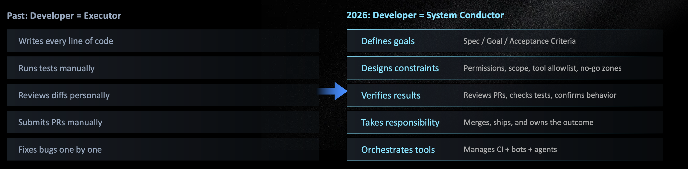

_Figure 14: Developers do not disappear in the agentic era. They move from doing actions by hand to defining goals, constraining actions, and verifying results._

## Software Will Keep Being Rewritten, But Open Source Remains Irreplaceable
In 2011, Marc Andreessen wrote “Software is eating the world.” Later, some people said open source was eating software, because open-source infrastructure became the default supply chain of modern software. **By 2026, a sharper question appeared: will models swallow software and open source?**

The answer looks more like a new division of labor.

Models will take over some actions that used to be carried by software interfaces: search, fill, organize, generate, jump, and call. But they cannot eat the order behind software. The closer models get to real work, the more software is needed to define boundaries, save state, connect systems, control permissions, record process, and handle failure.

Software will not disappear. It may become more abundant, but it will not look exactly like before. The real change is that many software-use behaviors once done by humans will become model-driven action chains. Software companies may first become “agent-usable companies.” In the past, SaaS was built around UI, accounts, business data, and workflows. In the agent era, SaaS also needs stable APIs and machine-readable docs. Interfaces still matter, but UI is no longer the only entry point. Whoever can let agents safely work for users may become the new platform.

Coding is only the first stop. The real world is messier and softer than code. Payments, finance, healthcare, government services, education, life services, and embodied intelligence all involve identity, responsibility, risk, regulation, trust, and human situations. For agents to enter these scenes, model capability is only the ticket. Institutions, products, and system design are the long race.
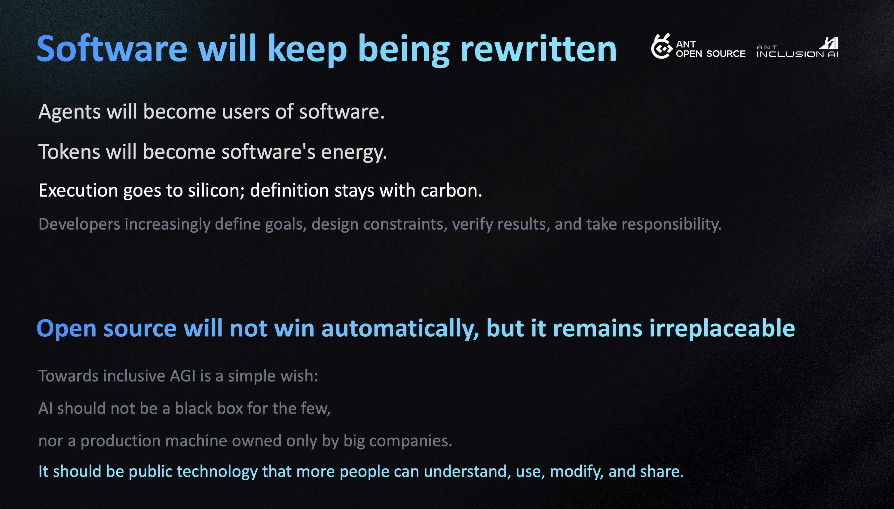

In 2025, the LLM developer ecosystem looked like a hackathon. Projects appeared quickly, became popular quickly, and disappeared quickly. By 2026, the **contest field is slowly turning into a construction site**.

Software will continue to be rewritten. Agents will become users of software. Tokens will become the energy of software. Developers will move from people who write every line by hand to people who define goals, design constraints, verify results, and take responsibility. Silicon executes. Carbon defines what is worth executing. This may be the most important division of labor in the Agentic AI era.

In this process, open source will not win automatically. But it still has an irreplaceable role. <u>The meaning of an open ecosystem is not only to provide code. It is also to let more people understand, use, change, and share intelligent infrastructure.</u>

Model companies can release stronger models. Cloud vendors can build larger AI factories. Application companies can make smoother closed-source products. <u>But what keeps an ecosystem healthy over the long term is still whether developers can participate, whether projects can be audited, whether standards can be built together, whether tools can be deployed locally, and whether knowledge can be shared.</u>

## Inclusive AGI: Intelligence Should Not Be a Privilege for the Few
Ant’s path over the past twenty years has been answering similar questions. In online transactions, why did people not trust one another? Why was it hard for small merchants to get services? Could complex and expensive capabilities, once available only to a few, become easier, cheaper, and more accessible? Twenty years ago, we believed financial services should not be a privilege for the few. Today, facing AGI, we believe intelligence should not be a privilege for the few either.

This may sound like a gentle slogan, but it is a hard judgment. The real world is much more complex than abstract problems. Math problems have standard answers. Code has tests. Games have rules. But services involve cost, trust, responsibility, emotion, compliance, regional differences, and people’s actual situations. A hospital appointment, an insurance claim, a small cross-border payment, or business advice for a small merchant cannot be solved simply by a higher benchmark.

This is why Inclusion AI’s open AGI practice covers Model, Model Infra, Agent Infra, and AI Service at the same time. Models define the capability boundary. Post-training, inference, and training systems turn capability into infrastructure that can be supplied at scale. Agent Infra lets developers and domain experts connect models to real workflows. AI Service brings these capabilities into concrete fields such as finance, healthcare, and life services. Without systems, models are only demos of capability. Without tools, models have trouble entering industries. Without an open ecosystem, inclusion becomes only a rental right from a few platforms.
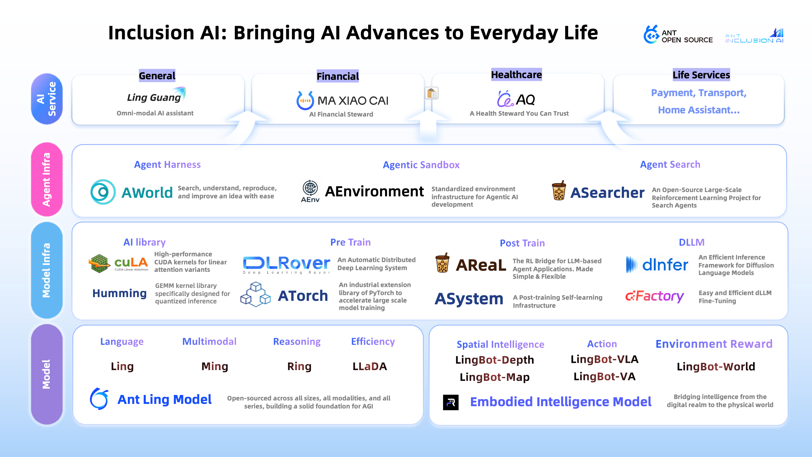

Towards inclusive AGI is a simple but important hope: AI should not become a black box for a few people. It should not be only a productivity machine for large companies. It should be a public technology that more people can understand, use, change, and share.

This can be reduced to three words: Available, Affordable, Inclusive.

+ Available means models and tools should be as open as possible, so developers, researchers, domain experts, and small or mid-sized organizations can access them, understand them, and adapt them. Open weights, data tools, inference engines, and agent protocols all lower the barrier. If intelligence is to become infrastructure, more people must be able to inspect it, adapt it, and improve it together.
+ Affordable means AI must really enter vertical scenarios: healthcare, finance, government services, education, public good, rural areas, and small businesses, not only premium subscriptions. The hard part is not making AI solve beautiful benchmark problems. The hard part is helping an older person book a hospital appointment, helping a small merchant run a business, or helping an ordinary family handle daily services at low enough cost.
+ Inclusive means the value of AI should not be captured only by large token consumers or a few platforms. Developers, open-source maintainers, data contributors, domain experts, and ordinary users should all have a place in the ecosystem. We need to respect real workflows and human experience, and let that experience compound through open collaboration into reusable tools and systems, instead of one-way releases.

Towards inclusive AGI does not mean everyone must become a model company. It does not mean everyone must write low-level frameworks. It is a simple but important hope: **AI should not become a black box for the few. It should not be only a productivity machine for large companies. It should be a public technology that more people can understand, use, change, and share.**

This may be the most important job for open source in the AGI era.

## Notes on Data Scope
The data mainly comes from the [Agentic AI landscape](https://github.com/antgroup/agentic-ai-landscape/blob/main/data/agentic-ai-projects.csv) repository, OpenDigger, GitHub API, Hugging Face Hub, OpenRouter public leaderboards, and searches across releases, issues, PRs, and GitHub Search API results for projects such as vLLM, SGLang, TensorRT-LLM, llama.cpp, Dynamo, and LiteLLM.

Agentic AI project trend data uses the April 2026 OpenRank scope. The developer profile covers activity from January 1, 2026 to before May 1, 2026, and keeps bot and app actors.

The model routing section refers to RouteLLM (ICLR 2025) and IPR (EMNLP Industry 2025). For RouteLLM, we use the conservative wording that routing can achieve more than 2x cost savings while staying close to strong-model quality. For IPR, we use the paper’s “100% strongest-model quality” operating point and the reported 43.9% cost reduction.
