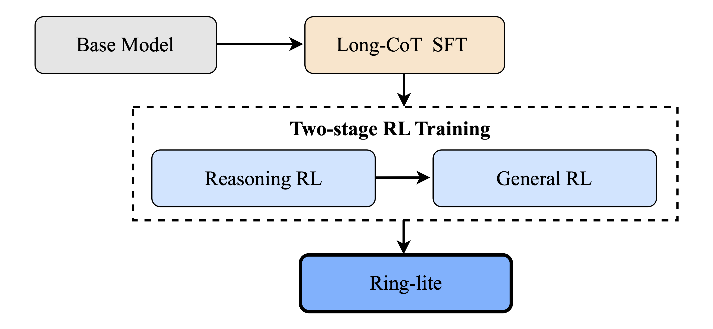

📖 [Technical Report](https://arxiv.org/abs/2506.14731) | 🤗 [Hugging Face](https://huggingface.co/inclusionAI/Ring-lite-2507)｜ 🤖 [ModelScope](https://modelscope.cn/models/inclusionAI/Ring-lite-2507)

## Overview
We present **Ring-lite-2507**, an upgraded version of our previously released lightweight reasoning model, **Ring-lite** (2506). Built upon a **16.8B** Mixture-of-Experts (MoE) large language model with **2.75B** activated parameters, **Ring-lite-2507** further advances its reasoning capabilities while demonstrating superior performance across a comprehensive range of LLM benchmarks, including general text understanding, alignment, coding, logical, and agentic tasks. Thanks to our innovative and robust reinforcement learning training pipeline, **Ring-lite-2507** distinguishes itself from the latest public dense models under 10B parameters by offering competitive performance across various tasks, despite activating only **1/3** of their parameter size.

To address the optimization instability of MoE RL training, we propose a novel approach, Constrained Contextual Computation Policy Optimization(C3PO), which enhances training stability and improves computational throughput via algorithm-system co-design. Additionally, we systematically investigate the dynamic relationship between long chain-of-thought SFT and RL training. Rather than relying solely on validation metrics, we explore optimal strategies for selecting the suitable fine-tuned model for RL scaling, yielding superior performance-efficiency trade-offs in our RL training pipeline. Last, we develop a two-stage training paradigm to harmonize multi-domain data integration, enhancing reasoning ability while effectively improving performance across various downstream general tasks.


**Highlights**

+ 🚀 **Superior performance across tasks**: Ring-lite-2507 demonstrates outstanding performance across both reasoning and general tasks;
+ 🔥 **Only 2.75B activated parameters**: Ring-lite-2507 is built upon a Mixture-of-Experts (MoE)-based large language model with only 2.75 billion activated parameters;
+ ⛓️‍💥 **Algorithm-system co-design**: We proposed novel C3PO approach and employ token efficiency to improve training stability and effectiveness;
+ 🔍 **Publicly available**: We fully release our training recipe and model weights.


## Evaluation
We conduct a comprehensive evaluation of our models across two main domains: reasoning and general. We utilize a diverse set of public benchmarks, organized according to the specific aspects they measure.

### Knowledge Understanding

| **Benchmark**   | **Ring-lite-2507** | **Ring-lite-2506** | **Qwen3-8B-Thinking** 
| :-------------: | :---------------: | :-----------: | :-------------------: | 
| MMLU-Pro (EM)         | 72.50	    | 63.44	    | **72.56** | 
| GPQA-Diamond (Pass@1) | **69.35**	    | 63.51	    | 62.00 | 
| SuperGPQA (EM)        | 40.05	    | 13.97	    | **40.36** | 
| Phybench (Pass@1)     | 28.51	    | **29.19**    | 22.14 |    


### Math

| **Benchmark**   | **Ring-lite-2507** | **Ring-lite-2506** | **Qwen3-8B-Thinking** 
| :-------------: | :---------------: | :-----------: | :-------------------: | 
| MATH-500 (Pass@1)             |   **97.95**	|   96.80	|   97.30       |
| CNMO 2024 (Pass@1)            |   75.09	|   **77.26**	|   74.57       |
| AIME 2024 (Pass@1)            |   **79.79**	|   79.00	|   74.90       |
| AIME 2025 (Pass@1)            |   **72.92**	|   69.50	|   67.19       |
| LiveMathBench (Pass@1)        |   83.37	|   **85.08**	|   81.90       |
| TheoremQA (Pass@1)            |   70.00	|   **70.19**	|   68.81       |
| OlympiadBench (math) (Pass@1) |   80.64	|   **82.86**	|   80.20       |

### Coding 

| **Benchmark**   | **Ring-lite-2507** | **Ring-lite-2506** | **Qwen3-8B-Thinking** 
| :-------------: | :---------------: | :-----------: | :-------------------: |
| LiveCodeBench(2408-2505) (Pass@1)     |**60.35**	    |   59.53   |	55.12   |
| Codeforces(Percentile) (Pass@1)       |**1830**	    |   1673    |	1580    |
| Codeforces(Rating)                    |**92.16**	    |   88.00   |	79.44   |

### Reasoning \& Agentic

| **Benchmark**   | **Ring-lite-2507** | **Ring-lite-2506** | **Qwen3-8B-Thinking** 
| :-------------: | :---------------: | :-----------: | :-------------------: | 
| DROP (zero-shot F1)    |   **89.27**  	  | 60.21   |	87.13   |
| BBH (EM)               |   **88.65**	  | 50.84   |	87.30   |
| ARCPrize (Pass@1)      |   **19.00**	  | 3.12    |	3.88    |
| MuSR (EM)              |   **77.19**	  | 66.77   |	76.92   |
| BFCL_Live (Pass@1)     |   74.81	  | 66.76   |	**75.99**   |

### Alignment

| **Benchmark**   | **Ring-lite-2507** | **Ring-lite-2506** | **Qwen3-8B-Thinking** 
| :-------------: | :---------------: | :-----------: | :-------------------: | 
| IFEval (Prompt Strict)    |   84.66   |   54.34   |	**85.40**   |
| AlignBench v1.1(gpt-4.1)  |   **80.90**   |	69.60   |	74.70   |
| FoFo (gpt-4-turbo)        |   **85.02**	|   67.81   |	81.93   |
| ArenaHard (gpt-4.1)       |   **88.85**	|   56.12   |	86.14   |


## Constrained Contextual Computation Policy Optimization(C3PO)
We introduce <u>C</u>onstrained <u>C</u>ontextual <u>C</u>omputation <u>P</u>olicy <u>O</u>ptimization(C3PO), an innovative token-level optimization framework designed to mitigate training instability while enhancing throughput consistency. Different from sampling-level filtering, C3PO operates at the token level by sampling tokens to form a token-level global batch, each training step maintains consistent token input to optimizer, which results in reduced gradient variance and consequently achieving stable optimization.

<div style="text-align:center;margin: auto; width: 100%;">
  
  <p style="font-size:14px; color:gray;">C3PO</p>
</div>

## Balancing Token efficiency between Distillation and RL
While distillation is effective, we find that it requires more training tokens to achieve comparable performance than RL training. Furthermore, we observe that varying the number of training epochs for the distilled model significantly influences the trend of entropy loss, thereby affecting the exploration scope for RL. Our experiments show that increasing the number of SFT training epochs leads to a rapid collapse in entropy, whereas insufficient SFT training inevitably results in inferior performance. To systematically quantify the choice of optimal SFT epoch, we employ token efficiency to determine the suitable checkpoint for RL scaling.

## Training Data
To ensure a high-quality training dataset for reinforcement learning, we established a comprehensive and meticulous data curation pipeline. This pipeline encompasses several key stages, such as data cleansing, answer verification, and data annotation, all designed to thoroughly decontaminate the data and ensure it is both suitable and informative for RL training.
<div style="text-align:center;margin: auto; width: 100%;">
  
  <p style="font-size:14px; color:gray;">Data Pipeline</p>
</div>

## Training Pipeline
<div style="text-align:center;margin: auto; width: 100%;">
  
  <p style="font-size:14px; color:gray;">Training Pipeline</p>
</div>

### Reasoning RL
Compared to our previously released Ring-lite-2506, we expanded our reasoning dataset by incorporating more challenging math, coding, and STEM data. Specifically, we adopted 67K math problems, 32K coding problems, and 9.9K scientific problems for reasoning RL training. In addition, we amplified our reasoning dataset by including more than 19K logical games, such as ARC-AGI, Countdown, Sudoku, AlphaMaze, etc. For each type of problem, we specifically designed suitable reward functions to ensure our training examples are verifiable. 


### General RL
Apart from reasoning tasks, our Ring-lite-2507 has significantly expanded the collection of general datasets for RL training. Our general RL training does not compromise performance on reasoning tasks; instead, it enhances overall text understanding across a broad range of general benchmarks.

Our general RL training incorporates a variety of tasks, including instruction following, question answering, text summarization, and more. For open-ended questions, we employ a robust reward model to assign appropriate scores. Additionally, we have integrated a rule-based verifier to handle problems that can be easily validated, such as instruction-following tasks.

## Citation

```bibtex
@misc{lingteam2025ringlitescalablereasoningc3postabilized,
      title={Ring-lite: Scalable Reasoning via C3PO-Stabilized Reinforcement Learning for LLMs}, 
      author={Ling Team and Bin Hu and Cai Chen and Deng Zhao and Ding Liu and Dingnan Jin and Feng Zhu and Hao Dai and Hongzhi Luan and Jia Guo and Jiaming Liu and Jiewei Wu and Jun Mei and Jun Zhou and Junbo Zhao and Junwu Xiong and Kaihong Zhang and Kuan Xu and Lei Liang and Liang Jiang and Liangcheng Fu and Longfei Zheng and Qiang Gao and Qing Cui and Quan Wan and Shaomian Zheng and Shuaicheng Li and Tongkai Yang and Wang Ren and Xiaodong Yan and Xiaopei Wan and Xiaoyun Feng and Xin Zhao and Xinxing Yang and Xinyu Kong and Xuemin Yang and Yang Li and Yingting Wu and Yongkang Liu and Zhankai Xu and Zhenduo Zhang and Zhenglei Zhou and Zhenyu Huang and Zhiqiang Zhang and Zihao Wang and Zujie Wen},
      year={2025},
      eprint={2506.14731},
      archivePrefix={arXiv},
      primaryClass={cs.CL},
      url={https://arxiv.org/abs/2506.14731}, 
}
```
