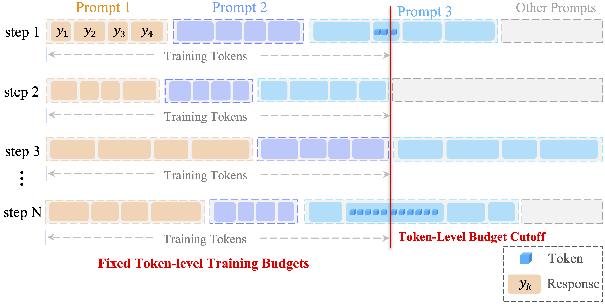
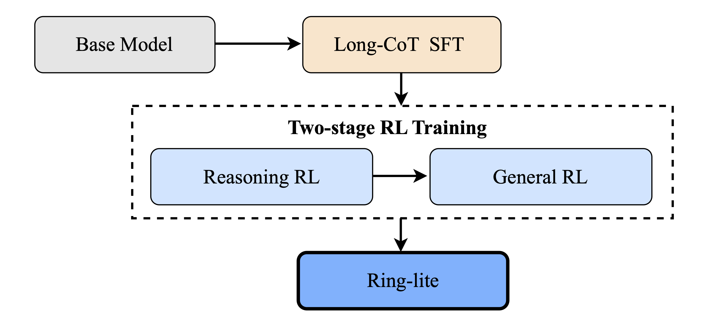

📖 [Technical Report](https://arxiv.org/abs/2506.14731) | 🤗 [Hugging Face](https://huggingface.co/inclusionAI/Ring-lite-2507)｜ 🤖 [ModelScope](https://modelscope.cn/models/inclusionAI/Ring-lite-2507)

## 概述
我们推出了**Ring-lite-2507**，该模型是在我们之前发布的轻量级推理模型**Ring-lite-2506**上的一次全面升级！**Ring-lite-2507**是一个激活参数为**2.75B**，总参数为**16.8B**的MoE大语言模型。此次升级，我们的模型不仅进一步提升了在数学、代码和逻辑任务上的推理能力，同时在知识理解、对齐和智能体等多个广泛使用的通用类评测榜单中取得了卓越的表现。通过我们提出的创新性强化学习算法和多阶段强化学习训练流程，**Ring-lite-2507**相比最新10B参数以下的Dense推理模型，在仅激活其1/3参数规模的情况下，在各项任务中达到了相当或更具竞争力的性能。

我们提出了一种创新的强化学习训练算法，即Constrained Contextual Computation Policy Optimization（C3PO），旨在解决MoE强化学习训练过程中的不稳定性问题。通过算法-系统协同设计，我们的方法同时提高了训练稳定性和计算吞吐量。此外，我们系统性地研究了长思维链SFT和RL训练之间的动态关系，并提出使用token效率指标来帮助我们探索选择更适合RL训练的微调模型，从而实现了RL训练过程中的性能和效率的双平衡。此外，我们还采用了新型两阶段强化学习的训练范式，以平衡多领域融合数据的训练效果，在增强推理能力的同时，更有效地提升各种下游通用任务的表现。


**亮点**

+ 🚀 **多项任务中的卓越表现**: Ring-lite-2507在推理和通用任务上均表现出卓越的性能；
+ 🔥 **仅激活2.75B模型参数**: Ring-lite-2507是一个基于MoE的大语言模型，仅激活了2.75B模型参数；
+ ⛓️‍💥 **算法-系统协同设计**: 我们创新性地提出了C3PO训练方法，并采用token效率来平衡RL训练的稳定性和有效性；
+ 🔍 **公开可用**: 我们的训练数据和模型权重均已公开。


## 模型评测
我们在两个主要领域对模型进行了全面评估：推理和通用。我们使用了一系列公开评测榜单来衡量模型能力，包括：知识理解、数学、代码、推理 \& 智能体，以及对齐任务。

### 知识理解

| **Benchmark**   | **Ring-lite-2507** | **Ring-lite-2506** | **Qwen3-8B-Thinking** 
| :-------------: | :---------------: | :-----------: | :-------------------: | 
| MMLU-Pro (EM)         | 72.50	    | 63.44	    | **72.56** | 
| GPQA-Diamond (Pass@1) | **69.35**	    | 63.51	    | 62.00 | 
| SuperGPQA (EM)        | 40.05	    | 13.97	    | **40.36** | 
| Phybench (Pass@1)     | 28.51	    | **29.19**    | 22.14 |    


### 数学

| **Benchmark**   | **Ring-lite-2507** | **Ring-lite-2506** | **Qwen3-8B-Thinking** 
| :-------------: | :---------------: | :-----------: | :-------------------: | 
| MATH-500 (Pass@1)             |   **97.95**	|   96.80	|   97.30       |
| CNMO 2024 (Pass@1)            |   75.09	|   **77.26**	|   74.57       |
| AIME 2024 (Pass@1)            |   **79.79**	|   79.00	|   74.90       |
| AIME 2025 (Pass@1)            |   **72.92**	|   69.50	|   67.19       |
| LiveMathBench (Pass@1)        |   83.37	|   **85.08**	|   81.90       |
| TheoremQA (Pass@1)            |   70.00	|   **70.19**	|   68.81       |
| OlympiadBench (math) (Pass@1) |   80.64	|   **82.86**	|   80.20       |

### 代码

| **Benchmark**   | **Ring-lite-2507** | **Ring-lite-2506** | **Qwen3-8B-Thinking** 
| :-------------: | :---------------: | :-----------: | :-------------------: |
| LiveCodeBench(2408-2505) (Pass@1)     |**60.35**	    |   59.53   |	55.12   |
| Codeforces(Percentile) (Pass@1)       |**1830**	    |   1673    |	1580    |
| Codeforces(Rating)                    |**92.16**	    |   88.00   |	79.44   |

### 推理 \& 智能体

| **Benchmark**   | **Ring-lite-2507** | **Ring-lite-2506** | **Qwen3-8B-Thinking** 
| :-------------: | :---------------: | :-----------: | :-------------------: | 
| DROP (zero-shot F1)    |   **89.27**  	  | 60.21   |	87.13   |
| BBH (EM)               |   **88.65**	  | 50.84   |	87.30   |
| ARCPrize (Pass@1)      |   **19.00**	  | 3.12    |	3.88    |
| MuSR (EM)              |   **77.19**	  | 66.77   |	76.92   |
| BFCL_Live (Pass@1)     |   74.81	  | 66.76   |	**75.99**   |

### 对齐

| **Benchmark**   | **Ring-lite-2507** | **Ring-lite-2506** | **Qwen3-8B-Thinking** 
| :-------------: | :---------------: | :-----------: | :-------------------: | 
| IFEval (Prompt Strict)    |   84.66   |   54.34   |	**85.40**   |
| AlignBench v1.1(gpt-4.1)  |   **80.90**   |	69.60   |	74.70   |
| FoFo (gpt-4-turbo)        |   **85.02**	|   67.81   |	81.93   |
| ArenaHard (gpt-4.1)       |   **88.85**	|   56.12   |	86.14   |


## Constrained Contextual Computation Policy Optimization(C3PO)
我们提出了一个创新性的token级强化学习训练算法，<u>C</u>onstrained <u>C</u>ontextual <u>C</u>omputation <u>P</u>olicy <u>O</u>ptimization（C3PO），该算法旨在通过稳定训练过程中token的吞吐量，从而提升强化学习训练的鲁棒性。与样本级的筛选不同，C3PO在token级别通过采样来形成一个全局固定的token批次，每个训练步骤都保证输入给优化器的token数量一致，从而降低了梯度方差，使得训练更加稳定。

<div style="text-align:center;margin: auto; width: 100%;">
  
  <p style="font-size:14px; color:gray;">C3PO</p>
</div>

## 在蒸馏和强化学习之间平衡token效率
尽管蒸馏训练在很多情况下表现出优秀的性能，但我们发现，与RL训练相比，它通常需要更多的训练迭代才能达到相当的性能。此外，我们观察到，蒸馏模型的训练迭代次数会显著影响RL训练中熵损失的走势，进而影响了RL的探索空间。从实验上来看，模型经过过多的SFT训练轮次可能会导致RL熵迅速崩溃，另一方面，SFT阶段训练不足也不可避免地会导致性能下降。为了系统性地量化最优SFT训练的程度，我们提出采用token效率指标来动态指导更适合强化学习的起始模型。

## 训练数据
为构建一个高质量的强化学习训练数据集，我们搭建了一个全面而细致的数据处理链路。这个链路包括多个关键阶段，如数据清洗、答案验证和数据标注等，从而确保我们的训练数据免于数据污染，同时具有信息量，更适用于强化学习训练。
<div style="text-align:center;margin: auto; width: 100%;">
  
  <p style="font-size:14px; color:gray;">Data Pipeline</p>
</div>

## 训练流程
<div style="text-align:center;margin: auto; width: 100%;">
  
  <p style="font-size:14px; color:gray;">Training Pipeline</p>
</div>

### 推理强化学习
与之前发布的Ring-lite-2506相比，我们通过整合更具挑战性的数学、代码和科学M数据来扩展了我们的推理数据集。具体来说，我们采用了67K个数学问题、32K个代码问题和9.9K个科学问题用于推理强化学习训练。此外，我们还通过引入超过19K个逻辑游戏，如ARC-AGI、Countdown、数独、AlphaMaze等，来进一步扩充我们的推理数据集。对于每种类型的问题，我们专门设计了适合的奖励函数，以确保我们的训练数据均是可被验证的。


### 通用强化学习
除了推理任务之外，我们的Ring-lite-2507在训练过程中广泛补充了用于RL训练的通用数据集。我们的通用RL训练不仅没有牺牲在推理任务上的强劲表现，同时，它在广泛的通用榜单评测中均展现了强大的文本理解以及通用任务能力。

我们的通用强化学习训练数据中包括了指令遵循、问答、文本摘要等多个不同任务。对于开放式问题，我们采用了一个通用奖励模型来计算奖励分数。此外，我们还集成了一个基于规则的验证器来处理易于验证的通用问题，例如指令遵循任务等。

## 引用

```bibtex
@misc{lingteam2025ringlitescalablereasoningc3postabilized,
      title={Ring-lite: Scalable Reasoning via C3PO-Stabilized Reinforcement Learning for LLMs}, 
      author={Ling Team and Bin Hu and Cai Chen and Deng Zhao and Ding Liu and Dingnan Jin and Feng Zhu and Hao Dai and Hongzhi Luan and Jia Guo and Jiaming Liu and Jiewei Wu and Jun Mei and Jun Zhou and Junbo Zhao and Junwu Xiong and Kaihong Zhang and Kuan Xu and Lei Liang and Liang Jiang and Liangcheng Fu and Longfei Zheng and Qiang Gao and Qing Cui and Quan Wan and Shaomian Zheng and Shuaicheng Li and Tongkai Yang and Wang Ren and Xiaodong Yan and Xiaopei Wan and Xiaoyun Feng and Xin Zhao and Xinxing Yang and Xinyu Kong and Xuemin Yang and Yang Li and Yingting Wu and Yongkang Liu and Zhankai Xu and Zhenduo Zhang and Zhenglei Zhou and Zhenyu Huang and Zhiqiang Zhang and Zihao Wang and Zujie Wen},
      year={2025},
      eprint={2506.14731},
      archivePrefix={arXiv},
      primaryClass={cs.CL},
      url={https://arxiv.org/abs/2506.14731}, 
}
```
